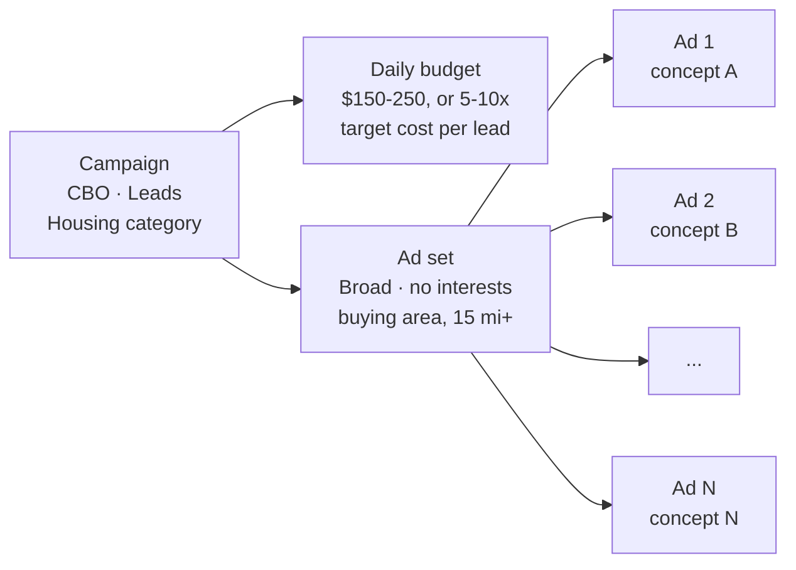

# Meta campaign setup: the first test campaign ("Punch 1")

How to build Property Abundance's first Meta campaign for its video ads, and the column view used to judge them. Written 2026-10-02.

**Source.** Paraphrased from two lessons in the Ad Creators Lab "Media Buying" classroom (Punch Phase): "Setting Up Your Ad Structure" and "Setup Custom Columns". The lesson videos and transcripts are members-only and stay local. The course teaches an e-commerce setup (website purchases). The changes a cash home buyer needs are in section 2 and marked **For us** below.

What to test, and how to read the numbers, is in [PERSUASIVE_SCRIPTING_PLAYBOOK.md](../11_Psychological_Hooks/PERSUASIVE_SCRIPTING_PLAYBOOK.md), sections 5 to 7. This file covers the build.

## 1. The plan

The first campaign is there to give Meta signals, not to scale. One campaign, one ad set, many ads (the course uses 25), each one a different concept.

Rules for the ads:

- One concept per ad, and every ad different. Not one ad with several hooks: hook variants are a scaling step for later.
- No dynamic or flexible ad options.
- The same in every ad: the CTA button, the destination (URL or form), the conversion event, and the copy (3 primary texts, 3 headlines, 3 descriptions).
- A fixed naming convention (section 4).

## 2. Changes for a cash home buyer

| The course | For us | Why |
|---|---|---|
| Objective Sales, event Purchase | Objective **Leads**, event **Lead** | We collect seller details; nothing is bought online. |
| No special ad category | **Housing**, United States | Meta requires it for ads about selling a home. It fixes age at 18-65+ and all genders, needs a radius of at least 15 miles (25 km), and allows no ZIP targeting, no lookalikes and no detailed-targeting exclusions (Meta Marketing API docs). |
| Website destination | Website only once the site and pixel work; otherwise an **Instant Form** | On 2026-10-02 the company site failed to load (HTTP 403 on http, certificate error on https). An Instant Form opens inside Facebook and Instagram and needs no website. |
| Purchase ROAS and Adds to cart columns | Drop both | There is no online sale to measure. |

## 3. Column preset "Creative Testing" (set up once)

Ads Manager → Campaigns → Columns → Customize columns.

Order: Budget · Delivery · Amount spent · Results · Cost per result · CTR (all) · Hook Rate · Hold Rate · Link clicks · CPM · Frequency · Post comments.

(The course also has Purchase ROAS after Cost per result and Adds to cart before Post comments.)

Make the two custom metrics in the Custom tab → Create custom metric, format **Percentage**:

| Name | Formula |
|---|---|
| Hook Rate | 3-second video plays ÷ Impressions |
| Hold Rate | Video plays at 50% ÷ Impressions |

Then Save as column preset → "Creative Testing".

**Watch the definitions.** The playbook (section 6) defines hold rate as ThruPlays ÷ 3-second plays. That is a different number from the course's Hold Rate above, so never compare the two. Pick one before round 1. For Instant Forms the playbook reads link CTR rather than CTR (all), so add "CTR (link click-through rate)" if you go that way.

## 4. Build it in Ads Manager

### Campaign

1. Create → **Leads** → Continue. Keep the manual setup.
2. Name: `CBO | Test | <offer> | <start date>`, for example `CBO | Test | Cash Offer | Oct 3`.
3. Special Ad Categories → **Housing** → United States.
4. Campaign budget (that is what CBO means), daily, bid strategy Highest volume. Leave the rest as it is: no budget or ad scheduling, A/B test off.

### Ad set

1. Name: `Broad | <buying area> | Creative Testing`.
2. Conversion location: Website, or Instant forms (section 2).
3. Performance goal: maximise conversions (leads). Dataset: the pixel. Event: **Lead**.
4. Attribution: 7-day click. The course's default; it says to match it to the funnel length (1-day click, or 7-day click / 1-day view).
5. Start now, no end date.
6. Location: the area Property Abundance buys in. Add nothing else, and remove any audience suggestions Meta adds; the audience should read as broad. Leave placements on Advantage+.

### Ads

1. Name: `<YYMMDD>_<concept>_V<n>`, for example `261003_Landlord_V1`. Add the format (`Vertical`, `Square`) when one concept has more than one.
2. Identity: the Property Abundance Facebook Page and Instagram account.
3. Manual upload → Video ad, then the destination.
4. Copy: 3 primary texts, 3 headlines, 3 descriptions, one CTA. Offer terms from the confirmed list only.
5. Turn off "Optimise text per person" and the other dynamic or flexible options.
6. Skip URL parameters for now.
7. Fill in the first ad completely. Then ⋯ → Duplicate, and change only the name and the video. Repeat for every concept, then Publish.

## 5. Reading the results

From the course, in the Creative Testing columns:

- Sort by Amount spent to see which ads Meta is sending spend to.
- Results and Cost per result: is that spend producing leads at a healthy cost?
- The highest Hook Rate shows which hook to reuse in new concepts.
- The highest Hold Rate shows the most watched body.
- Read the comments for objections and new hook ideas.

Then follow the playbook's section 7 (diagnose → fix → next test).

## 6. What not to do

- No traffic campaigns.
- No extra ad sets split by interests or other targeting.
- No single ad carrying several hooks.
- No changes to the CTA, destination, event or copy from one ad to the next.

## 7. Open before launch

- **Destination:** fix the site and install the pixel with a Lead event, or use an Instant Form.
- **Buying area:** the city or state the campaign covers.
- **Budget:** the daily budget, or the target cost per lead it is based on.
- **Concepts:** finished, approved cuts only, each one a different concept.

## Sources

- Meta Marketing API, Special Ad Categories: https://developers.facebook.com/docs/marketing-api/audiences/special-ad-category/
